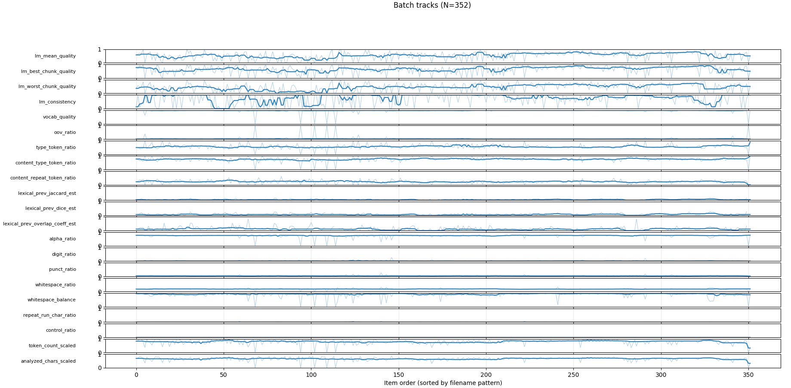
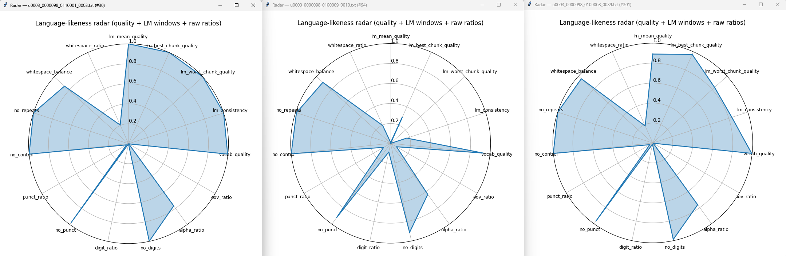
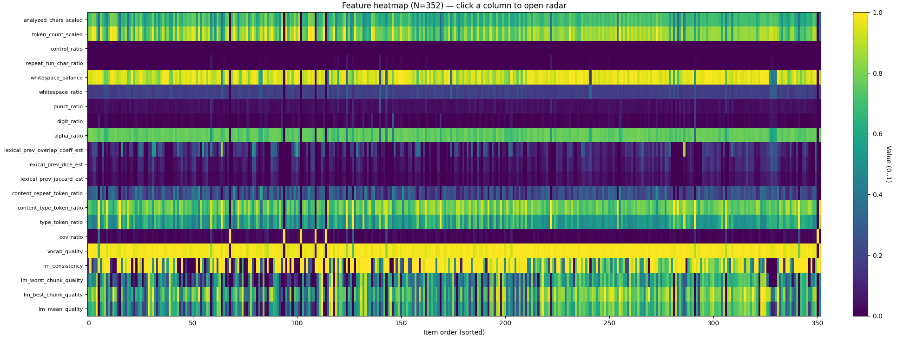
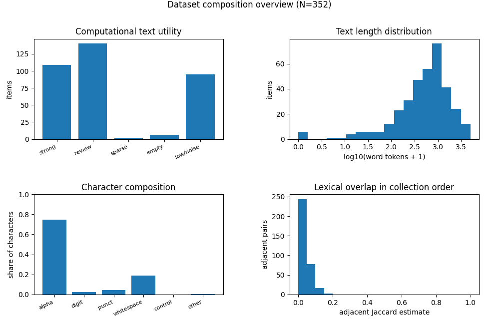

# Language-Likeness Evaluator for OCR Transcript Stream profiling and characterization

A Python 3.10 Tkinter application for evaluating plain text OCR transcripts and visualizing the computational character of text datasets from research archives, special collections, and other heterogeneous digitization pipelines.



The application scores each `.txt` file for language-likeness, vocabulary coverage, character composition, repeated character artifacts, lexical diversity, and MinHash lexical sketches. It writes one JSON report per input file, then reloads those reports for item level radar plots, collection batch visualizations, heatmaps, and dataset composition summaries.

This project is intended for exploratory quality assessment of legacy OCR/HTR transcript corpora where ground-truth transcriptions are not available and where many images may have been sent through OCR regardless of whether they actually contained machine readable text.

---

## Core use cases

- Identify OCR transcripts that are likely usable computational text versus sparse, noisy, or non-text outputs.
- Compare individual transcript profiles using radar plots.
- Visualize feature behavior across a collection in stable archival item order.
- Detect contiguous runs of similar quality, repeated boilerplate, templates, duplicated OCR, or format shifts.
- Generate collection level dataset composition summaries for digital archivists, data scientists, and computational research collaborators.
- Preserve file analysis outputs as portable JSON.

---

## Application overview

The application has three main GUI areas.

### 1. Evaluate Text Files

Select one or more plain-text files and an output directory. The app evaluates each input and writes a JSON report named:

```text
<input_stem>__langlikeness__<sha12>.json
```

The evaluation tab exposes controls for:

- Hugging Face causal language model name, default `distilgpt2`
- device selection: `auto`, `cpu`, or `cuda`
- maximum characters analyzed per file, default `200000`
- minimum repeated-character run length, default `3`
- whether whitespace runs are excluded from the repeated-character metric

Evaluation runs in a worker thread so the Tkinter interface remains responsive and progress can be reported.

### 2. Visualize JSON Reports

Load one or more JSON reports and visualize them as radar charts. The same radar plotter supports a single item or transparent overlays of multiple items.



Radar modes currently include:

- `quality`: normalized language-likeness and composition quality axes where higher values generally mean more language-like text.
- `quality_windowed`: language-model window-distribution axes plus raw OOV, digit, punctuation, and whitespace ratios.
- `raw_scaled`: direct ratio-style composition features, including a scaled log-perplexity axis where higher log-perplexity is worse.
- `lexical`: lexical-diversity and vocabulary-profile axes, including type-token and content-token ratios.

Radar plots can be saved as PNG images.

### 3. Batch Visualizer

Load a directory of JSON reports and render collection-level visualizations.



Batch visualizer features include:

- Directory loading for `*.json` reports.
- Regex-based ordering by filename pattern, default `(\d+)(?!.*\d)` in the GUI. In plain form, this captures the last integer in the filename.
- Natural-sort fallback when the regex is missing, invalid, or does not match.
- Stacked collection-order feature tracks.
- Optional centered rolling median smoothing.
- Feature heatmap with items on the x-axis and selected metrics on the y-axis.
- Click-to-select heatmap columns and open an item-level radar popup.
- Automatic heatmap binning for very large batches, currently above 2500 displayed columns.
- Dataset Composition sub-tab with a textual summary, overview charts, and summary JSON export.



---

## Metrics generated per file

Each JSON report contains file metadata, configuration values, raw measurements, derived radar values, and lexical sketches. The application does **not** store the original transcript text in the JSON report, but it does store the source path and a SHA-256 hash of the source bytes.

### File metadata

Stored under `file`:

- source path
- basename
- byte size
- SHA-256 hash
- source modified timestamp in UTC

### Character composition

The analyzer counts characters by Unicode/category behavior and stores both raw counts and ratio-style features:

- alphabetic characters
- digits
- punctuation
- control characters
- whitespace
- other characters
- non-whitespace characters
- character-to-whitespace ratio

Relevant JSON locations:

```text
analysis.char_counts
analysis.features_raw.alpha_ratio
analysis.features_raw.digit_ratio
analysis.features_raw.punct_ratio
analysis.features_raw.control_ratio
analysis.features_raw.whitespace_ratio
analysis.features_raw.other_ratio
analysis.features_raw.non_whitespace_ratio
analysis.features_raw.char_to_whitespace_ratio
```

### Repeated-character artifacts

The repeated-run metric counts characters that belong to repeated sequences at least `min_repeat_run` characters long. By default, the run threshold is `3`, and whitespace runs are excluded from the primary repeat metric.

Relevant JSON locations:

```text
analysis.features_raw.repeat_run_char_ratio
analysis.features_raw.repeat_run_nonws_char_ratio
analysis.features_raw.max_repeat_run
```

These values help identify common OCR artifacts such as repeated punctuation, ruler lines, false glyph loops, and unusually regular non-language output.

### Dictionary and OOV metrics

The application tokenizes alphabetic word-like strings using this pattern:

```text
[A-Za-z]+(?:'[A-Za-z]+)?
```

It then uses the Python `wordfreq` package as a lightweight English vocabulary resource. Tokens with non-zero English Zipf frequency are treated as in-vocabulary. The out-of-vocabulary ratio is:

```text
oov_ratio = oov_count / token_count
```

Relevant JSON locations:

```text
analysis.dictionary.token_count
analysis.dictionary.oov_count
analysis.dictionary.oov_ratio
analysis.features_raw.oov_ratio
```

### Language model metrics

The application uses a Hugging Face causal language model, default `distilgpt2`, to score normalized text using sliding-window negative log-likelihood. For large texts, this avoids scoring only the first model-context window.

Stored language model values include:

```text
analysis.language_model.model_name
analysis.language_model.device
analysis.language_model.token_count
analysis.language_model.avg_cross_entropy_nats
analysis.language_model.avg_cross_entropy_bits
analysis.language_model.perplexity
analysis.language_model.avg_log_likelihood
analysis.language_model.total_log_likelihood
analysis.language_model.log_perplexity
```

The main relationships are:

```text
avg_cross_entropy_nats = negative_log_likelihood / predicted_token_count
perplexity = exp(avg_cross_entropy_nats)
avg_cross_entropy_bits = avg_cross_entropy_nats / log(2)
avg_log_likelihood = -avg_cross_entropy_nats
total_log_likelihood = -negative_log_likelihood
```

The app also stores window-distribution statistics useful for mixed-quality OCR:

```text
analysis.language_model.window_count
analysis.language_model.window_loss_mean_nats
analysis.language_model.window_loss_std_nats
analysis.language_model.window_loss_p10_nats
analysis.language_model.window_loss_p90_nats
analysis.language_model.window_loss_min_nats
analysis.language_model.window_loss_max_nats
```

These support radar axes such as:

- `lm_mean_quality`
- `lm_best_chunk_quality`
- `lm_worst_chunk_quality`
- `lm_consistency`

The normalized LM quality axes are configured by `log_ppl_good` and `log_ppl_bad` in `AnalyzerConfig`. Lower language-model loss is mapped to higher quality.

### Lexical diversity metrics

The lexical profile stores type-token and repetition ratios for filtered tokens.

For a token list `T` and unique token set `U`:

```text
type_token_ratio = len(U) / len(T)
repeat_token_ratio = 1 - type_token_ratio
```

The application stores both full-token and content-token versions. Content tokens are lowercased tokens after minimum-length filtering and optional stopword removal.

Relevant JSON locations:

```text
analysis.lexical.tokens.token_count
analysis.lexical.tokens.unique_token_count
analysis.lexical.tokens.type_token_ratio
analysis.lexical.tokens.repeat_token_ratio
analysis.lexical.content_tokens.token_count
analysis.lexical.content_tokens.unique_token_count
analysis.lexical.content_tokens.type_token_ratio
analysis.lexical.content_tokens.repeat_token_ratio
analysis.features_raw.type_token_ratio
analysis.features_raw.repeat_token_ratio
analysis.features_raw.content_type_token_ratio
analysis.features_raw.content_repeat_token_ratio
```

### MinHash lexical sketch

Each report can store a MinHash signature for the content-token set. This lets the batch visualizer estimate lexical overlap between adjacent items without reloading the original text.

Relevant JSON location:

```text
analysis.lexical.minhash
```

The default sketch configuration is:

```text
minhash_k = 64
minhash_seed = 1
```

The signature is stored as a list of hex strings. It is computed from lowercase content tokens, using a stable SHA-1-derived 64-bit token hash and a reproducible family of universal hash functions.

---

## Batch lexical-overlap metrics

When a directory of JSON reports is loaded in the Batch Visualizer, reports are sorted by the filename regex / natural-sort logic, then adjacent lexical overlap is estimated between item `i - 1` and item `i`.

The first item has no previous neighbor, so adjacent-overlap values are `NaN` for the first row.

### Estimated adjacent Jaccard similarity

```text
lexical_prev_jaccard_est = matching_minhash_slots / minhash_k
```

This estimates set Jaccard similarity between adjacent items' content-token sets:

```text
J(A, B) = |A ∩ B| / |A ∪ B|
```

### Estimated Dice coefficient

The Dice coefficient is derived from the Jaccard estimate:

```text
lexical_prev_dice_est = 2J / (1 + J)
```

### Estimated overlap coefficient

The overlap coefficient is estimated from Jaccard and the two content-token set sizes:

```text
intersection_est = J * (a + b) / (1 + J)
lexical_prev_overlap_coeff_est = intersection_est / min(a, b)
```

where `a` and `b` are the unique content-token counts for the previous and current items.

These adjacent metrics are added to each loaded report in memory under `analysis.features_raw` for visualization. They are not written back to the original per-item JSON files unless the application is extended to do so.

---

## Dataset Composition summary

The Dataset Composition sub-tab summarizes a loaded report directory at a collection or batch level. It can also export a JSON summary.

The summary includes:

- item/report count
- source directory and ordering regex
- first and last ordered item
- report schema versions
- language model names
- report creation timestamp range
- total source bytes
- total analyzed characters
- total dictionary word tokens
- total language-model tokens
- total lexical and content tokens
- count of items with MinHash signatures
- length distributions for bytes, characters, word tokens, LM tokens, lexical tokens, and content tokens
- heuristic computational-text utility classes
- OCR/text warning flags
- core feature distributions
- weighted character composition
- adjacent lexical-overlap distributions
- longest high-overlap run
- top adjacent lexical-overlap pairs

The built-in heuristic classes are triage aids, not ground-truth OCR accuracy labels. Current thresholds are:

```text
strong_computational_text:
  word_tokens >= 20
  lm_mean_quality >= 0.70
  oov_ratio <= 0.35

usable_or_review_text:
  word_tokens >= 10
  lm_mean_quality >= 0.40
  oov_ratio <= 0.60
  excluding items already classified as strong

sparse_or_tiny_text:
  some text, but fewer than 10 word tokens or fewer than 50 analyzed characters

empty_or_no_word_tokens:
  zero analyzed characters or zero dictionary word tokens

low_likelihood_or_noise_like:
  remaining items not meeting the above heuristics
```

Overview charts include:

- computational text utility category counts
- log-scaled word-token length distribution
- weighted character composition
- adjacent lexical-overlap distribution

---

## Installation

### Requirements

- Python 3.10 or later in the Python 3.10 family targeted by this project
- Tkinter support for your Python installation
- Internet access on first run if the selected Hugging Face model is not already cached
- Optional NVIDIA CUDA environment if you plan to use `device=cuda`

Tkinter is part of the Python standard library on many desktop installs, especially Windows and macOS Python.org distributions. Some Linux distributions package it separately, often as `python3-tk`.

### Create a virtual environment

Windows PowerShell:

```powershell
py -3.10 -m venv .venv
.\.venv\Scripts\Activate.ps1
python -m pip install --upgrade pip
pip install -r requirements.txt
```

macOS / Linux:

```bash
python3.10 -m venv .venv
source .venv/bin/activate
python -m pip install --upgrade pip
pip install -r requirements.txt
```

The default `requirements.txt` installs the standard CPU-capable PyTorch package from PyPI. For a CUDA-specific PyTorch build, install the PyTorch build appropriate for your local CUDA version before or instead of the default `torch` line.

---

## Running the application

If the repository uses the current development filename:

```bash
python langlikeness_app_optionB_plus_raw_batch_lexoverlap_v4_dataset_composition.py
```

If the script has been renamed for release:

```bash
python langlikeness_app.py
```

On first use of the default model, Hugging Face model and tokenizer files for `distilgpt2` will be downloaded and cached locally by the `transformers` / `huggingface_hub` stack. Subsequent runs can use the cached files.

---

## Recommended workflow

1. Create a clean output directory for JSON reports.
2. Use **Evaluate Text Files** to process one collection or a meaningful subset of a collection.
3. Use **Visualize JSON Reports** to inspect individual items and small sets with radar plots.
4. Use **Batch Visualizer** to load the report directory.
5. Confirm or adjust the filename ordering regex so the x-axis reflects archival item order.
6. Review **Stacked Tracks** and **Feature Heatmap** for runs, gaps, and outliers.
7. Open item-level radar plots from heatmap clicks when specific regions need inspection.
8. Use **Dataset Composition** to export a collection-level JSON summary.

---

## Interpreting common patterns

- High `lm_mean_quality`, low `oov_ratio`, and high `alpha_ratio` usually indicate usable English-language computational text.
- Low `lm_worst_chunk_quality` with reasonable mean quality suggests a mixed transcript with some good text and some corrupted regions.
- High `repeat_run_char_ratio` can indicate OCR loops, line artifacts, table borders, or repeated glyph errors.
- High `digit_ratio` may be normal for ledgers, inventories, financial documents, box/folder lists, forms, or IDs. It should not always be read as an error.
- High `punct_ratio` may indicate tables, lists, formatting artifacts, or OCR noise.
- Very short texts can produce unstable language-model, lexical-diversity, and overlap scores; use token and character length tracks as interpretive context.
- High adjacent lexical overlap can indicate multi-page continuity, duplicate text, repeated forms/templates, boilerplate, or repeated OCR artifacts.
- Low adjacent lexical overlap in a stable series can indicate topic changes, format changes, poor OCR, or missing text.

---

## JSON report structure

A typical report has this top-level structure:

```json
{
  "schema_version": 1,
  "created_at_utc": "...",
  "config": {},
  "file": {},
  "analysis": {
    "analyzed_chars": 0,
    "truncated_to_max_chars": false,
    "char_counts": {},
    "dictionary": {},
    "lexical": {},
    "language_model": {},
    "features_raw": {},
    "radar": {}
  }
}
```

The report is intended to be readable by the current GUI and by external analysis tools in Python, R, OpenRefine, or notebook workflows.

---

## Data privacy and preservation notes

- The JSON report stores metrics, configuration, source metadata, and a SHA-256 hash, but not the original transcript body.
- The JSON report does store the original file path. If paths contain sensitive collection, donor, or workstation information, sanitize reports before public release.
- MinHash signatures are compact lexical sketches, not direct full-text transcripts. They still encode limited information about token-set similarity and should be treated as derived text data.
- Per-file JSON reports and exported dataset-composition summaries are more reviewable and preservation-friendly than temporary GUI state.

---

## Limitations

- Scores are model-specific and should not be treated as ground-truth OCR accuracy.
- The default language model and dictionary assumptions are English-oriented.
- `distilgpt2` is a small, general-purpose causal language model; collection-specific calibration may improve results.
- Dictionary OOV scoring can penalize names, dialect, historical spelling, domain terminology, and multilingual material.
- OCR noise can create plausible but incorrect words, so language-likeness does not guarantee textual correctness.
- MinHash overlap is approximate and set-based; it does not preserve word order or token frequency.
- Filename-pattern sorting must reflect real collection order for adjacent-overlap plots to be meaningful.

---

## Repository layout

Suggested minimal layout:

```text
.
├── README.md
├── requirements.txt
└── langlikeness_app.py
```

For development continuity, the current script may retain its longer filename:

```text
langlikeness_app_optionB_plus_raw_batch_lexoverlap_v4_dataset_composition.py
```

---

## Citation / acknowledgement text

Suggested short description for reuse in repository metadata, documentation, or project reports:

> Language-Likeness Evaluator is a Python/Tkinter application for ground-truth-free exploratory assessment of OCR transcript corpora. It generates per-file JSON reports with language-model, dictionary, character-composition, lexical-diversity, and MinHash lexical-overlap metrics, and provides radar, stream, heatmap, and dataset-composition views for collection-level quality review.

---

## License

The current source header states MIT licensing. Add a formal `LICENSE` file to the repository before release or dissemination if this project will be shared publicly.
